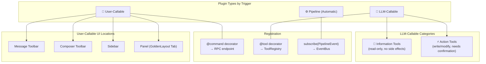
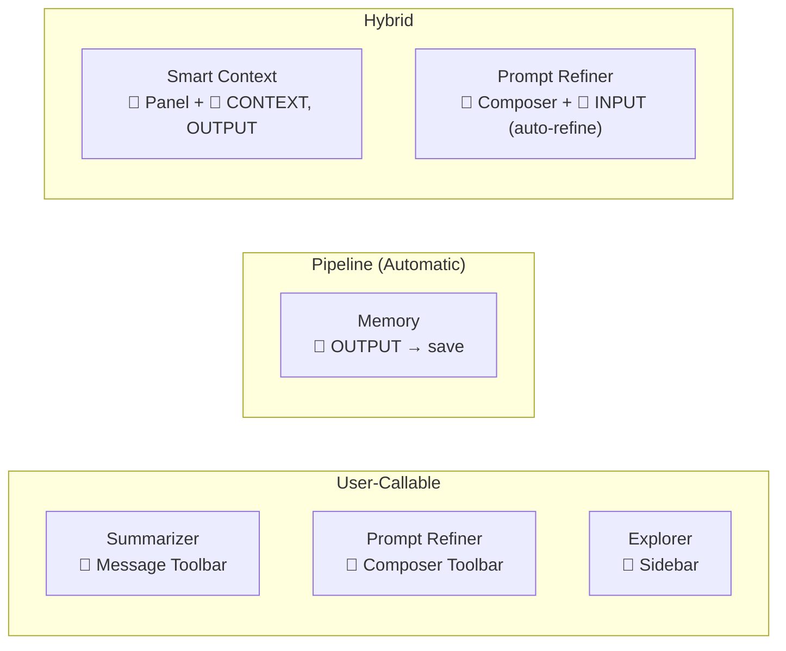

# Plugin Architecture

> Tailor's plugin system is the backbone of all functionality. Everything beyond the core pipeline is a plugin.

## Architecture Overview



## Plugin Types

### 1. User-Callable Plugins

**Trigger:** User clicks a button or interacts with UI.
**Registration:** `@command` decorator → `brain.register_command()`

| UI Location | How to Register | Example Plugin |
|---|---|---|
| **Message Toolbar** | `register_action` with `location: "message-actionbar"` | Summarizer — "Summarize" button on each message |
| **Composer Toolbar** | `register_action` with `location: "composer-actionbar"` | Prompt Refiner — "Refine" wand icon in input area |
| **Sidebar** | `register_sidebar_view()` + `set_sidebar_content()` | Explorer — chat history sidebar |
| **Panel (Tab)** | `register_panel()` + `set_panel_content()` | Smart Context — topic map in GoldenLayout tab |

### 2. LLM-Callable Plugins (Tool Registry)

**Trigger:** LLM autonomously decides to call the tool during pipeline execution.
**Registration:** `@tool` decorator → `brain.tool_registry.register()`

| Category | Description | Confirmation? | Examples |
|---|---|---|---|
| **Information** | Read-only, fetches data for the LLM | No, runs freely | `web_search`, `read_url`, `search_vault` |
| **Action** | Writes/modifies state, has side effects | Yes, needs user approval | `create_event`, `send_email`, `save_note` |

Use the `category` field in `@tool` metadata to distinguish:

```python
@tool(name="search_web", category="information", description="Search the web")
def search_web(query: str) -> str: ...

@tool(name="create_event", category="action", description="Create calendar event")
def create_event(title: str, date: str) -> str: ...
```

### 3. Pipeline Plugins (Automatic)

**Trigger:** Runs automatically on every message via pipeline event hooks.
**Registration:** `self.subscribe(PipelineEvents.*, handler)`

| Event | When It Fires | Example |
|---|---|---|
| `START` | Pipeline begins | Logging, analytics |
| `INPUT` | After input received | Auto-refine (Prompt Refiner) |
| `CONTEXT` | Before prompt assembly | Context filtering (Smart Context) |
| `PROMPT` | Before LLM call | Prompt injection, RAG |
| `LLM` | During LLM execution | Model routing |
| `POST_PROCESS` | After LLM response | Formatting, safety filters |
| `OUTPUT` | Final output ready | Memory save, topic extraction |
| `END` | Pipeline complete | Cleanup |

### 4. Mixed / Hybrid Plugins

A single plugin can combine multiple types. This is common and powerful.

**Example: Calendar Plugin (hypothetical)**

```python
class Plugin(PluginBase):
    def register_commands(self):
        # User-callable: button in composer toolbar
        self.brain.register_command("calendar.add_event", self.add_event, self.name)

        # LLM-callable: LLM can query calendar autonomously
        self.brain.tool_registry.register(self.check_availability)
        self.brain.tool_registry.register(self.create_event)

    @tool(name="check_calendar", category="information",
          description="Check if user is available on a given date")
    def check_availability(self, date: str) -> str:
        return self._query_calendar(date)

    @tool(name="create_event", category="action",
          description="Create a new calendar event")
    def create_event(self, title: str, date: str) -> str:
        return self._create_event(title, date)

    async def on_load(self):
        # Pipeline: auto-add context about today's schedule
        self.subscribe(PipelineEvents.CONTEXT, self._inject_schedule)
```

This single plugin is simultaneously:
- **User-callable** (UI button to add events)
- **LLM-callable** (LLM can check/create events via `@tool`)
- **Pipeline** (auto-injects today's schedule into context)

## Existing Plugin Map



| Plugin | User-Callable | LLM-Callable | Pipeline | UI Location |
|---|:---:|:---:|:---:|---|
| **Summarizer** | ✅ | — | — | Message Toolbar |
| **Prompt Refiner** | ✅ | — | ✅ (auto-refine on INPUT) | Composer Toolbar |
| **Explorer** | ✅ | — | — | Sidebar |
| **Smart Context** | ✅ | — | ✅ (CONTEXT, OUTPUT) | Panel |
| **Memory** | — | — | ✅ (OUTPUT) | — (invisible) |
| **Chat Branches** | ✅ | — | — | — |

## Vault Isolation

Each vault runs its own sidecar process with its own `VaultBrain` singleton. This means:

- **Plugins are per-vault** — each vault has its own `plugins/` directory
- **ToolRegistry is per-vault** — `self.tool_registry` is created in `VaultBrain.__init__`
- **Pipeline is per-vault** — the LangGraph is constructed from vault-specific config
- **No shared state** between vaults — different plugins, different tools, different graphs

```
Vault A (summarizer, search)     Vault B (calendar, memory)
  └─ Sidecar :9000                 └─ Sidecar :9001
     └─ VaultBrain                    └─ VaultBrain
        ├─ ToolRegistry: [search]     ├─ ToolRegistry: [calendar]
        └─ Pipeline: [...]            └─ Pipeline: [...]
```

## Quick Reference: Which Decorator/API to Use

| I want the plugin to... | Use |
|---|---|
| Be triggered by a UI button | `@command` + `register_action()` |
| Be called by the LLM autonomously | `@tool` + `tool_registry.register()` |
| Run automatically on every message | `self.subscribe(PipelineEvents.*)` |
| Show a panel/tab in the layout | `register_panel()` |
| Show a sidebar section | `register_sidebar_view()` |
| Inject CSS/JS into the frontend | `emit_to_frontend(UI_COMMAND, inject_css/inject_html)` |
